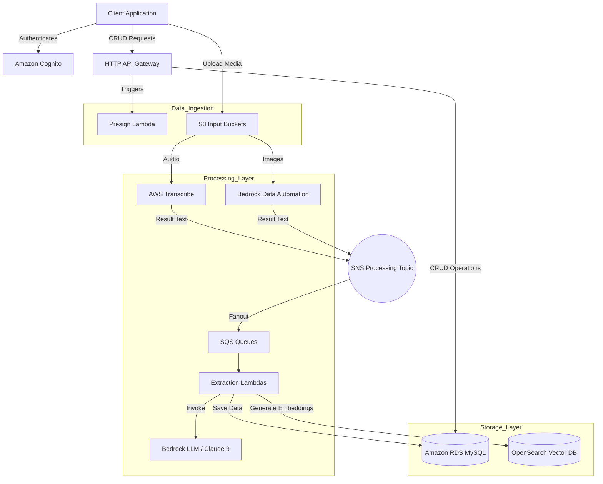

# Precicted Me 

Predicted Me is a [little app](https://drive.google.com/file/d/1xsHUxDbI-98RVbMdnLeAI7sJ-skNid4D/view?usp=sharing) which I developed few years ago. It's all in my private repo. But a few months ago I decided to refactor. So I'll be slowly pulling pieces of the logic to the public world. 

# Personal Data Intelligence Platform

A serverless, cloud-native backend designed to aggregate, process, and analyze personal data streams. This project allows users to input unstructured data via text, audio, or images, and uses Generative AI (AWS Bedrock) to extract structured insights such as quantifiable metrics, actionable tasks, nutrition data, and web links.

## 🚀 Key Features

*   **Multi-Modal Ingestion**:
    *   **Text**: Direct note entry.
    *   **Audio**: Automatic transcription via AWS Transcribe.
    *   **Image**: Image analysis and text extraction using AWS Bedrock Data Automation.
*   **AI-Powered Extraction**: Uses LLMs (Claude 3 Sonnet) to parse unstructured notes into:
    *   **Metrics**: Numerical data with units (e.g., "Weight: 80kg", "Run distance: 5km").
    *   **Tasks**: Actionable items with priority and scheduling.
    *   **Links**: URLs with generated summaries and descriptions.
    *   **Nutrients**: Detailed breakdown of food logs into calories and macros.
*   **Semantic Search**: Vector embeddings (Titan Embeddings) stored in OpenSearch for natural language search of notes.
*   **Recurrent Data Engine**: Cron-based scheduling for recurring tasks and metric generation.
*   **Secure Infrastructure**:
    *   **Auth**: User management via Amazon Cognito.
    *   **Network**: VPC with private subnets for database and processing layers.
    *   **Database**: Amazon RDS (MySQL) with SQLAlchemy ORM.
    *   **Bastion Host**: Secure access to private resources.
*   **Asynchronous Processing**: Event-driven architecture using SNS and SQS for decoupled, reliable AI processing.

## 🏗 Architecture

The system is built using the AWS Cloud Development Kit (CDK) in Python. It utilizes a microservices approach where specific stacks handle distinct data modalities.



## 🛠 Installation

This project uses **AWS CDK** for infrastructure as code.

### Prerequisites
*   Python 3.9+
*   Node.js (for AWS CDK CLI)
*   Docker (required for building Lambda images)
*   AWS CLI configured with appropriate permissions

### Setup

1.  **Clone the repository**:
    ```bash
    git clone <repository-url>
    cd <repository-directory>
    ```

2.  **Install Python dependencies**:
    ```bash
    pip install -r requirements.txt
    ```

3.  **Set up Environment Variables**:
    Create a `.env` file or export the following variables (referenced in `shared/variables.py`):
    ```bash
    export AWS_ACCOUNT="123456789012"
    export AWS_REGION="us-east-1"
    export DB_NAME="pm_db"
    export DB_USER="admin"
    export HOSTED_ZONE_ID="Z12345..."
    export DOMAIN_NAME="api.yourdomain.com"
    # ... see shared/variables.py for full list
    ```

4.  **Synthesize the CloudFormation templates**:
    ```bash
    export PYTHONPATH=$PYTHONPATH:./infra:./backend:./shared
    cdk synth --app "python infra/app.py"
    ```

5.  **Deploy the infrastructure**:
    ```bash
    cdk deploy --all --app "python infra/app.py"
    ```

## 💻 Usage

The API is secured via Amazon Cognito. You must obtain a JWT ID Token to make requests.

### Authentication
Authenticate using the AWS SDK or CLI against the created User Pool to get an `Authorization` token.

### API Examples

**1. Create a Note (Text)**
The backend will asynchronously process this text to extract metrics and tasks.
```bash
curl -X POST https://api.predicted.me/note \
  -H "Authorization: Bearer <YOUR_JWT_TOKEN>" \
  -H "Content-Type: application/json" \
  -d '{"text": "Ran 5 miles today in 40 minutes. Need to buy groceries tomorrow."}'
```

**2. Upload Audio/Image (Presigned URL)**
First, get a URL to upload the file to S3 directly.
```bash
curl -X GET "https://api.predicted.me/presign?extension=mp4&method=PUT" \
  -H "Authorization: Bearer <YOUR_JWT_TOKEN>"
```
*Upload the file to the returned URL. The system will auto-transcribe/analyze it.*

**3. Fetch Extracted Metrics**
```bash
curl -X GET "https://api.predicted.me/metric?name=Distance%20run" \
  -H "Authorization: Bearer <YOUR_JWT_TOKEN>"
```

**4. Create a Metric Schedule**
Define a target value to be generated automatically if not logged.
```bash
curl -X POST "https://api.predicted.me/metric/1/schedule" \
  -H "Authorization: Bearer <YOUR_JWT_TOKEN>" \
  -d '{"target_value": 100, "period_seconds": 86400}'
```

## 📂 Project Structure

```
.
├── infra/                  # Infrastructure as Code (AWS CDK)
│   ├── app.py              # Entry point for CDK application
│   ├── pm/                 # Stack definitions
│   │   ├── api_stack.py    # API Gateway & Lambda integrations
│   │   ├── db_stack.py     # RDS & Database initialization
│   │   ├── text_stack.py   # Text processing & OpenSearch
│   │   ├── image_stack.py  # Image processing (BDA)
│   │   └── ...             # Audio, VPC, Cognito, etc.
│
├── backend/                # Application Logic
│   ├── functions/          # Lambda Function handlers
│   │   ├── note/           # Note CRUD
│   │   ├── metric/         # Metric CRUD
│   │   ├── processing/     # AI Extraction Logic
│   │   │   ├── tagging/    # Categorization logic
│   │   │   └── extraction/ # Nutrient/Data extraction
│   │   └── ...             # User, Task, Search, etc.
│   ├── lib/                # Shared Code
│   │   ├── db.py           # SQLAlchemy Models (User, Note, Metric, etc.)
│   │   ├── util.py         # Helper functions (Bedrock calls, SQS parsing)
│   │   └── func/           # Lambda middleware (HTTP handlers, SQS processors)
│   └── tests/              # Integration tests
│
└── shared/                 # Shared configurations
    ├── variables.py        # Environment variable mapping
    └── constants.py        # String constants & schema keys
```

## 🧪 Testing

The project includes a robust suite of integration tests located in `backend/tests/`. These tests utilize a local or dev database connection to verify logic flow from API handlers to Database persistence.

To run tests:
```bash
python -m unittest discover backend/tests/integration
```
